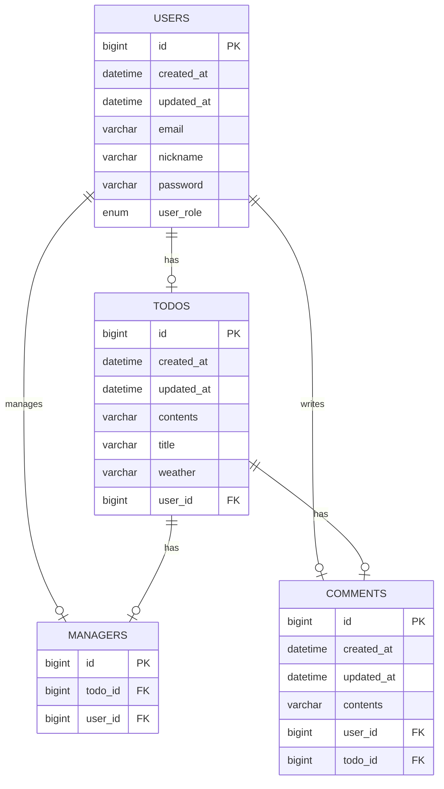

# SPRING PLUS
Spring Boot 기반의 일정 관리 웹 애플리케이션으로, 사용자 인증, 일정 생성 및 관리, 일정에 대한 댓글 생성 기능을 제공합니다.

<br>

## 🛠️ 사용 기술
- Java 17
- Spring Boot 3.3.3
- Spring Data JPA
- MySQL 9.1.0 (Driver 포합)
- BCrypt 0.10.2
- Lombok
- JJWT 0.11.5
- Spring Security
- QueryDSL 5.0.0

<br>

## 🔗 ERD


<br>

## 🧪 주요 기능
1. **Spring Security**를 통한 인증 및 권한 관리
2. **JWT**를 활용한 토큰 기반 인증
3. **BCrypt**를 이용한 비밀번호 암호화
4. 유저(회원/관리자), 일정, 댓글 관련 CRUD 기능

<br>

## 📜 Table
1. user
```mysql
CREATE TABLE users (
    id BIGINT AUTO_INCREMENT PRIMARY KEY,
    email VARCHAR(255) NULL UNIQUE,
    password VARCHAR(255) NULL,
    user_role ENUM('USER', 'ADMIN') NULL,
    nickname VARCHAR(255) NULL,
    created_at DATETIME(6),
    modified_at DATETIME(6)
);
```

<br>

2. todos
```mysql
CREATE TABLE todos (
    id BIGINT AUTO_INCREMENT PRIMARY KEY,
    title VARCHAR(255) NULL,
    contents VARCHAR(255) NULL,
    weather VARCHAR(255),
    user_id BIGINT NOT NULL,
    created_at DATETIME(6)  NULL,
    modified_at DATETIME(6)  NULL,
    FOREIGN KEY (user_id) REFERENCES users(id)
);
```

<br>

3. comments
```mysql
CREATE TABLE comments (
    id BIGINT AUTO_INCREMENT PRIMARY KEY,
    contents VARCHAR(255) NULL,
    user_id BIGINT NOT NULL,
    todo_id BIGINT NOT NULL,
    created_at DATETIME(6)  NULL,
    modified_at DATETIME(6)  NULL,
    FOREIGN KEY (user_id) REFERENCES users(id),
    FOREIGN KEY (todo_id) REFERENCES todos(id)
);
```

<br>

4. managers
```mysql
CREATE TABLE managers (
    id BIGINT AUTO_INCREMENT PRIMARY KEY,
    user_id BIGINT NOT NULL,
    todo_id BIGINT NOT NULL,
    FOREIGN KEY (user_id) REFERENCES users(id),
    FOREIGN KEY (todo_id) REFERENCES todos(id)
);
```

<br>

## 📑 API

## 🔷Todo API
### 1. 일정 생성
- 설명: 새로운 일정을 저장합니다.
- URL: /todos
- Method: POST
- Request Body
```json
{
  "title": "string",
  "contents": "string"
}
```
- Response Body:
```json
{
  "id": "long",
  "title": "string",
  "contents": "string",
  "weather": "string",
  "user": "userResponse"
}
```

<br>

### 2. 일정 조회
- 설명: 요청받은 날짜, 기간에 맞는 일정을 페이지별로 조회 합니다.
- URL: /todos
- Method: GET
- Request Param(required=false)
  * ```page```: 페이지 번호 (기본값: 1)
  * ```size```: 페이지 크기 (기본값: 10)
  * ```weather```: 특정 날씨 조건 필터
  * ```startDate```: 일정의 시작 날짜 (형식: yyyy-MM-dd)
  * ```endDate```: 일정의 종료 날짜 (형식: yyyy-MM-dd)
- Response Body:
```json
[
    {
      "id": "long",
      "title": "string",
      "contents": "string",
      "weather": "string",
      "user": "userResponse",
      "createdAt": "LocalDateTime",
      "modifiedAt": "LocalDateTime"
    }
]
```

<br>

### 3. 일정 단일 조회
- 설명: id에 맞는 일정을 단건 조회 합니다.
- URL: /todos
- Method: GET
- Response Body:
```json
{
  "id": "long",
  "title": "string",
  "contents": "string",
  "weather": "string",
  "user": "userResponse",
  "createdAt": "LocalDateTime",
  "modifiedAt": "LocalDateTime"
}
```

<br>

### 4. 일정 검색
- 설명: 조건에 맞는 일정을 검색합니다.
- URL: /todos/search
- Method: GET
- Request Param(required=false)
    * ```title```: 일정 제목
    * ```managerNickname```: 관리자 닉네임
    * ```startDate```: 일정의 시작 날짜 (형식: yyyy-MM-dd)
    * ```endDate```: 일정의 종료 날짜 (형식: yyyy-MM-dd)
- Response Body:
```json
[
  {
    "title": "string",
    "managerNum": "long",
    "commentNum": "long"
  }
]
``` 

<br>

## 🔷User API
### 1. 회원가입
- 설명: 새로운 사용자를 등록합니다.
- URL: /auth/signup
- Method: POST
- Request Body
```json
{
  "email": "string",
  "password": "string",
  "nickname": "string",
  "userRole": "string"
}
```
- Response Body:
```json
{
  "bearerToken": "string"
}
```

<br>

### 2. 사용자 로그인
- 설명: 로그인 및 JWT 토큰을 발급 받습니다.
- URL: /auth/signin
- Method: POST
- Request Body
```json
{
  "email": "string",
  "password": "string"
}
```
- Response Body:
```json
{
  "bearerToken": "string"
}
```

<br>

### 3. 사용자 역할 변경
- 설명: 관리자 권한으로 특정 사용자의 역할을 변경합니다.
- URL: /admin/users/{userId}
- Method: PATCH
- Request Body:
  - ```role```: "ADMIN", "USER"
```json
{
  "role": "string"
}
```

<br>

### 4. 사용자 정보 조회
- 설명: 특정 사용자의 정보를 조회합니다.
- URL: /users/{userId}
- Method: GET
- Response Body:
```json
{
  "id": "long",
  "email": "string"
}
```

<br>

### 5. 비밀번호 변경
- 설명: 인증된 사용자가 자신의 비밀번호를 변경합니다.
- URL: /users
- Method: PUT
- Request Body:
```json
{
  "oldPassword": "string",
  "newPassword": "string"
}
```

<br>

## 🔷Manager API
### 1. 매니저 추가
- 설명: 특정 일정(Todo)에 매니저를 추가합니다.
- URL: /todos/{todoId}/managers
- Method: POST
- Request Body:
```json
{
  "managerUserId": "long"
}
```
- Response Body:
```json
{
  "id": "long",
  "user": "userResponse"
}
```

<br>

### 2. 매니저 조회
- 설명: 특정 일정(Todo)의 모든 매니저를 조회합니다.
- URL: /todos/{todoId}/managers
- Method: GET
- Response Body:
```json
[
  {
    "id": "long",
    "user": "userResponse"
  }
]
```

<br>

### 3. 매니저 삭제
- 설명: 특정 일정(Todo)의 매니저를 삭제합니다.
- URL: /todos/{todoId}/managers/{managerId}
- Method: DELETE

<br>

## 🔷Comment API
### 1. 댓글 추가
- 설명: 특정 일정(Todo)에 댓글을 추가합니다.
- URL: /todos/{todoId}/comments
- Method: POST
- Request Body:
```json
{
  "contents": "string"
}
```
- Response Body:
```json
{
  "id": "long",
  "contents": "string",
  "user": "userResponse"
}
```

<br>

### 2. 댓글 조회
- 설명: 특정 일정(Todo)의 모든 댓글을 조회합니다.
- URL: /todos/{todoId}/comments
- Method: GET
- Response Body:
```json
[
  {
    "id": "long",
    "contents": "string",
    "user": "userResponse"
  }
]
```