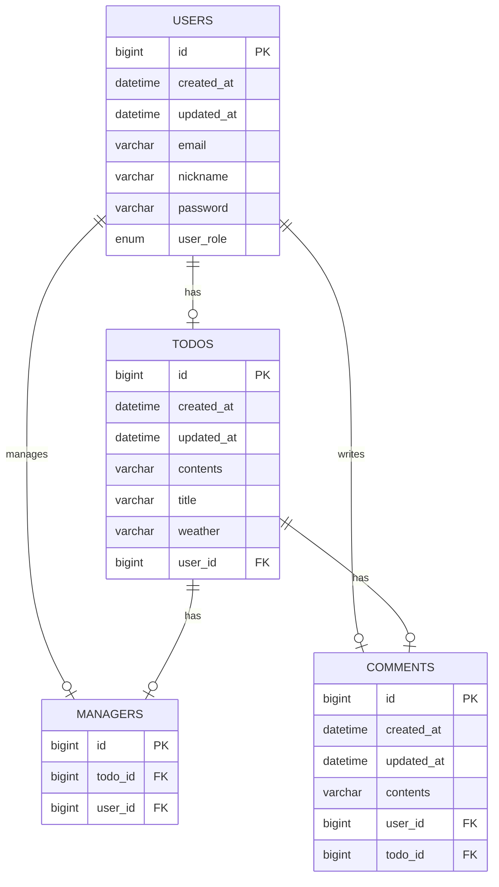

# SPRING PLUS

## 🛠️ 사용 기술
- Java 17
- Spring Boot 3.3.3
- Spring Data JPA
- MySQL 9.1.0 (Driver 포합)
- BCrypt 0.10.2
- Lombok
- JJWT 0.11.5
- Spring Security
- QueryDSL 5.0.0
- 
## 🔗 ERD

```mermaid
erDiagram
    USERS {
        bigint id PK
        datetime created_at
        datetime updated_at
        varchar email
        varchar nickname
        varchar password
        enum user_role
    }
    TODOS {
        bigint id PK
        datetime created_at
        datetime updated_at
        varchar contents
        varchar title
        varchar weather
        bigint user_id FK
    }
    MANAGERS {
        bigint id PK
        bigint todo_id FK
        bigint user_id FK
    }
    COMMENTS {
        bigint id PK
        datetime created_at
        datetime updated_at
        varchar contents
        bigint user_id FK
        bigint todo_id FK
    }

    USERS ||--o| TODOS: has
    USERS ||--o| MANAGERS: manages
    USERS ||--o| COMMENTS: writes
    TODOS ||--o| MANAGERS: has
    TODOS ||--o| COMMENTS: has
```